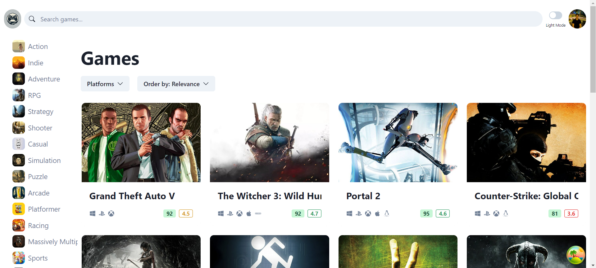
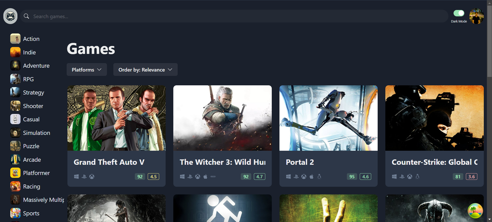
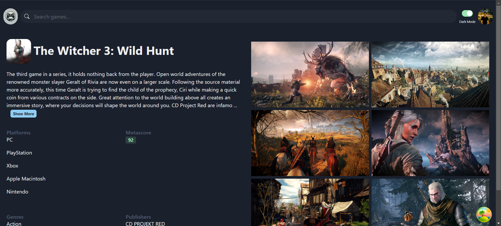

# Project Documentation

## Project Details
The Game Catalogue App is a platform designed for gaming enthusiasts to browse and discover a wide variety of video games. The app features an intuitive interface that allows users to explore games by genre and platforms, view detailed game information, and toggle between light and dark modes for a personalized user experience.

## Screenshots of the Application

_This shows the landing page in light mode._

_This shows the landing page in dark mode._

_This is the details page displayed in dark mode._

## Hosted Platform

- The application is currently hosted on **Vercel**.
- [Link to live application](https://game-catalogue-app.vercel.app/)

## Notes Learned

### Why React Query?

1. No request canceling.
2. No clear separation of concerns.
3. No retry mechanism.
4. No automatic data refresh.
5. No caching mechanism.

**React Query** provides built-in solutions for these issues, making it a powerful tool for managing server-side data in React apps.

### React Query vs. Redux

- **React Query** is more suited for server-side state management (e.g., fetching and caching data from APIs).
- **Redux** can handle both server-side and client-side state but often leads to more boilerplate.

> **Recommendation:**  
> Use **React Query** for server-side state and either **Zustand** or local state with **React Context** for client-side state management.

### Reducer

A **reducer** is a function that centralizes state updates within a component or across the app. It takes the current state and an action, then returns a new state.

### State Management Strategy

- **Server state:** Use **React Query**.
- **Client state:** Use **local state** and **React Context**, or solely use **Zustand** for simplified client-side state management.

### What is Redux?

**Redux** is a state management library for JavaScript applications. It helps store local variables in a **global state** rather than inside components. This allows for easier management of shared data across multiple components, eliminating the need for passing props down through component trees.
